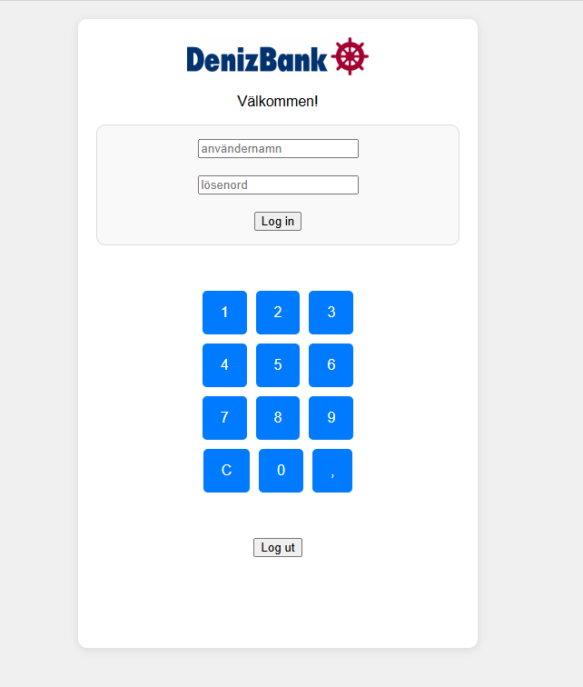
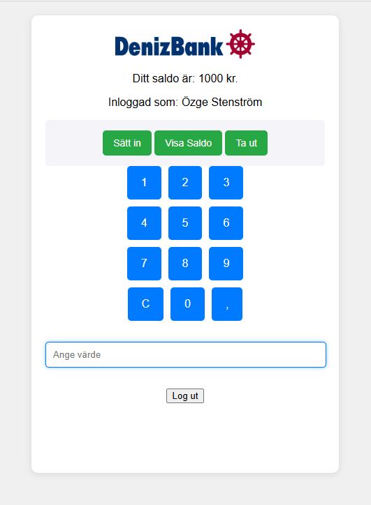
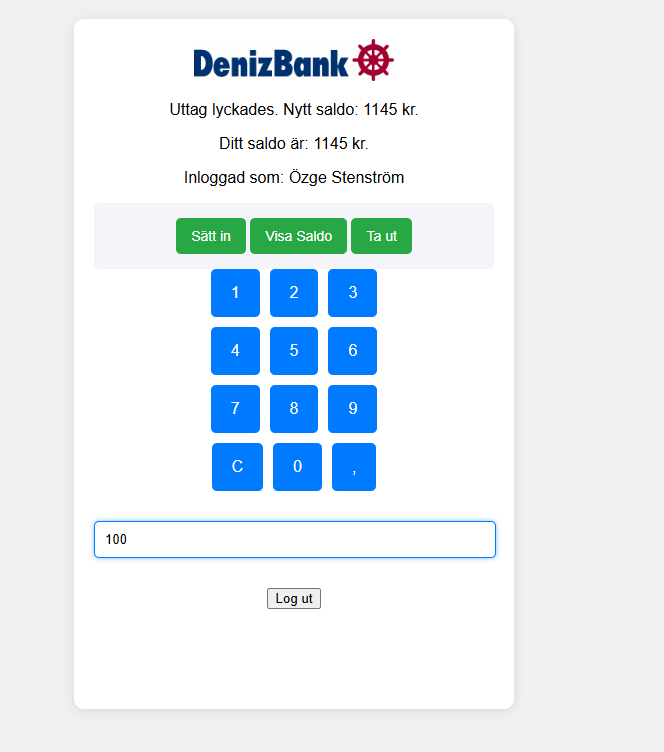

# Bankomat App

A simple **ATM simulation built with HTML, CSS and JavaScript**.  
The application allows a user to log in, check their balance, deposit money and withdraw money using a numeric keypad interface.

This project was created in **2024** as part of a **distance course in web development** and was my **first project using JavaScript**.

## Features

- User login
- Display current balance
- Deposit money
- Withdraw money
- Numeric keypad for entering amounts
- Simple UI that mimics an ATM interface

## Test Users

| Username | Password |
|--------|--------|
| özge | pass1 |
| salar | pass2 |

## Screenshots

### Login screen

  

### ATM interface

  

### Balance display

  

## Technologies

- HTML
- CSS
- JavaScript (Vanilla JS)

## How to run the project

1. Download or clone the repository
2. Open `index.html` in a browser

No installation or server is required.

## Possible improvements

Since this was my first JavaScript project, there are several areas that could be improved in the future:

- Move inline `onclick` events from HTML to JavaScript using `addEventListener`
- Improve code structure and naming consistency
- Add better input validation for numbers and decimals
- Store users and balances in **localStorage** or a backend instead of memory
- Improve accessibility (labels, keyboard navigation)
- Improve UI responsiveness and layout
- Refactor UI updates to make the code more modular